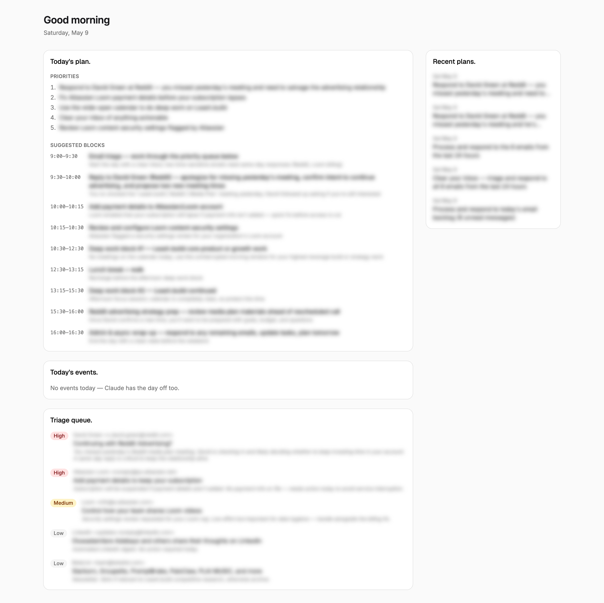

# Daypilot

> The Leash example app — your day, planned, by Claude.

Daypilot pulls today's calendar events and the last 24 hours of email through `@leash/sdk`, hands them to Claude, and renders a prioritized day plan, your raw events, and a triage queue of emails that need a response today. Every plan is saved to a Postgres table; the sidebar shows the last seven.

It's also the canonical example for how to build on Leash. Five patterns, each with a file pointer:



## Quickstart

```bash
gh repo clone leash-build/daypilot my-daypilot
cd my-daypilot && npm install
leash login                                          # Google OAuth
leash init --name daypilot                           # creates the app + .leash/config.json
leash db create                                      # provisions the bound Postgres
leash db shell daypilot < supabase/schema.sql        # apply the plans table
# Open https://leash.build/dashboard/connections and connect Gmail + Calendar
# Open https://leash.build/dashboard/apps/<id>/secrets and set ANTHROPIC_API_KEY
leash dev                                            # run with secrets injected
```

When you're ready to ship: `leash deploy` puts it live at `daypilot-{username}.un.leash.build`.

## How the SDK is used

`src/lib/integrations.ts` builds an authenticated server-side client from the incoming request and fetches today's primary-calendar events plus the last 24h of Gmail in parallel. `src/app/api/today/route.ts` is the orchestrator — it identifies the user (via `getLeashUser`), calls the integrations helper, hands the result to Claude, persists the plan, and returns the bundle.

The SDK reads the user's `leash-auth` cookie automatically — no token wiring on your part. Provider OAuth (Gmail, Calendar) is configured once in your Leash dashboard; daypilot never sees raw OAuth tokens.

## What's in `.env.example`

Only the env keys daypilot's *application code* reads. For v1 that's just `ANTHROPIC_API_KEY`. The file's comments explain the contract:

- **Don't declare** Leash-managed vars (`LEASH_*`, `SUPABASE_*`) — those are auto-injected.
- **Don't declare** `DATABASE_URL` *if you used `leash db create`* — the bound DB injects it for you.
- **Do declare** your own keys (Anthropic, Stripe, OpenAI, etc.) and set their values in the dashboard.

The BYO-database override is the bottom half of the file: a commented-out `DATABASE_URL=` line that flips the data store from the Leash-bound DB to your own Postgres without changing any code.

## What's in `.gitignore`

Real `.env` files (`.env`, `.env.local`, `.env.*.local`) — never commit secrets. Plus standard Next.js outputs and the Leash CLI cache.

`.env.example` *is* committed. It's the contract; values live in your dashboard.

## The CLI flow

| Command | What it does |
|---|---|
| `leash login` | Google OAuth; stores a token in your system keychain |
| `leash init --name daypilot` | Creates the server-side app row, writes `.leash/config.json` |
| `leash db create` | Provisions a managed Postgres for this app; auto-injects `DATABASE_URL` |
| `leash db shell daypilot < supabase/schema.sql` | Applies the schema |
| `leash dev` | Starts `next dev` with secrets pulled from your dashboard |
| `leash deploy` | Builds + deploys; live at `daypilot-{username}.un.leash.build` |

`leash dev` only injects keys that are declared in `.env.example`. If you add an integration that needs a new key, declare it there and set the value in the dashboard.

## How the bound DB is used (and how to BYO)

Daypilot persists every generated plan to one table. Schema: [`supabase/schema.sql`](./supabase/schema.sql). Helpers: [`src/lib/db.ts`](./src/lib/db.ts) — a singleton `pg.Pool` reading `process.env.DATABASE_URL`, plus `savePlan` and `recentPlans`.

By default, `leash db create` provisions a Postgres and auto-injects `DATABASE_URL`. Nothing in your code or `.env.example` changes.

To bring your own Postgres (Supabase project, RDS, Neon, etc.):

1. Skip `leash db create`.
2. Uncomment `DATABASE_URL=` in your local `.env.example` (and commit if you want this to be the new default for collaborators).
3. Set the connection string in your dashboard secrets.
4. Apply `supabase/schema.sql` to your DB out-of-band (`psql "$YOUR_URL" < supabase/schema.sql`).
5. `leash dev` injects your `DATABASE_URL` like any other declared key.

`src/lib/db.ts` doesn't change — same code reads either source.

## Deploy

```bash
leash deploy
```

Pushes to `https://daypilot-{your-username}.un.leash.build`. Future redeploys are the same command; environment is pulled from your dashboard, the schema is left alone.

## What this *isn't*

This is the polished, productivity-focused example. If you need something that demonstrates wiring multiple integrations into your own server (without an AI layer), see [`leash-build/nextjs-with-integrations`](https://github.com/leash-build/nextjs-with-integrations) — it's the lower-level reference.

A second curated example focused on the **multi-database** pattern (BigQuery + production replica + bound local DB in one screen) is tracked in [LEA-182](https://linear.app/leashbuild/issue/LEA-182).

## License

MIT — see `LICENSE`.
